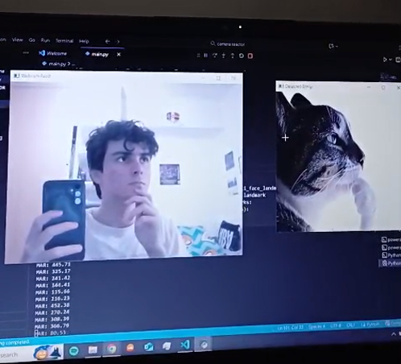

# Emoji Reactor

A Python project that detects facial expressions and hand gestures in real-time from your webcam and displays corresponding emojis in a separate window.  

Inspired by [Emoji Reactor](https://github.com/aaronhubhachen/emoji-reactor) by Aaron Hubhachen.

---

## Features

- **Smile detection** → shows `smile.png`.
- **Thumbs-up detection** → shows `thumbsup.png`.
- **Thinking gesture (hand on chin)** → shows `thinking.png`.
- **Resting face** → shows `rest.png`.
- Two windows:
  1. **Webcam Feed**: live video from your camera.
  2. **Detected Emoji**: shows the emoji corresponding to your detected gesture.
- Smoothed detection to prevent flickering.

---

## Demo



---

## Installation

1. Clone this repository:

```bash
git clone https://github.com/LagBack/face-reactions.git
cd face-reactions
```

2. Install the required Python packages. It's recommended to use a virtual environment:

```bash 
pip install opencv-python mediapipe numpy
```
3. Make sure your emoji images are in the same folder as the script:

- smile.jpg
- thumbsup.png
- rest.png
- thinking.jpg

## Usage

Run the main script:

```bash
python main.py
```

- Press q to quit the program.

- Position your face and hands in front of the webcam for detection.

- The emoji window will update based on your detected gestures and facial expressions.

## How It Works

- **Face Mesh** from [MediaPipe](https://github.com/google-ai-edge/mediapipe) detects facial landmarks.  
- **Hand tracking** from MediaPipe detects hand landmarks.  
- **Smile detection** uses the Mouth Aspect Ratio (MAR); smaller MAR values indicate a smile.  
- **Thumbs-up detection** checks if the thumb is up and other fingers are down.  
- **Thinking detection** measures the distance between hand fingertips and the chin; if close enough, it triggers the “thinking” emoji.  
- **Smoothing counters** prevent flickering for rapid movements.

---

## Credits

- Inspired by [Aaron Hubhachen's Emoji Reactor](https://github.com/aaronhubhachen/emoji-reactor)  
- Built using [MediaPipe](https://github.com/google-ai-edge/mediapipe) and [OpenCV](https://opencv.org/)

---

## License

This project is open source and available under the MIT License.
